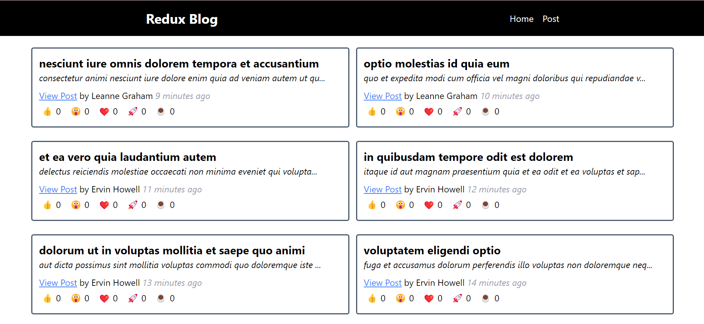
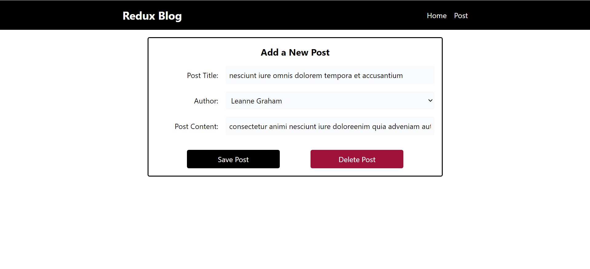
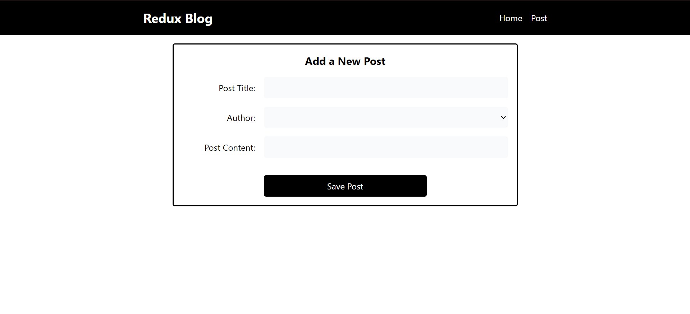

# 📝 Blog App

Welcome to my Blog App! 🚀 Blog platform built using React and Redux Toolkit. It lets you create, update, delete, and view posts in a user-friendly way. It's also hooked up to a fake API using jsonplaceholder.typicode.com

💡 Features

- Create Posts: Write and add new blog posts directly through the app.
- Update Posts: Made a mistake? No worries—just edit your posts anytime.
- Delete Posts: Clean up your blog by deleting posts you no longer want.
- View All Posts: Easily browse through all the posts that have been added.
- Reactions: Show some love to posts by adding reactions like 👍, 😮, ❤️, 🚀, and ☕.

Post List

Edit Post List

Add Post Form

🛠️ Tech Stack

Frontend: React with Redux Toolkit
Backend API: Axios with jsonplaceholder.typicode.com
Styling: Tailwindcss
State Management: Redux Toolkit with Async Thunks

🚀 Getting Started

- git clone https://github.com/taripuspitasari/redux-blog-app.git
- cd redux-blog-app
- npm install
- npm run dev
